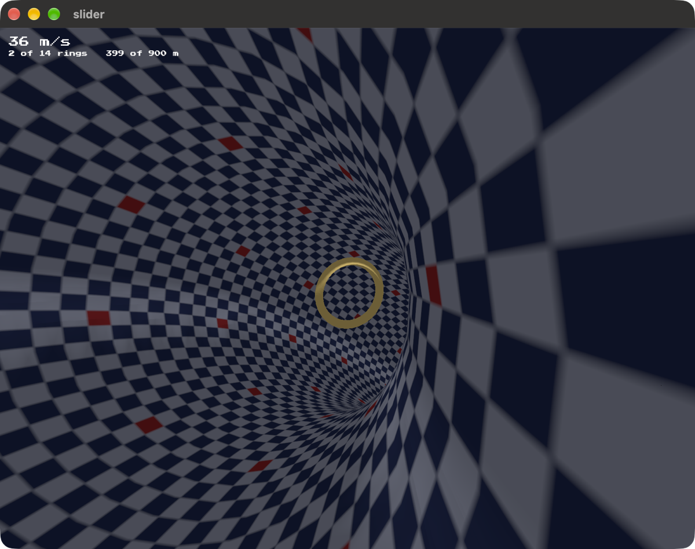

# slider

Fly down a tunnel that wanders, through fourteen rings strung along it. You
speed up the further you get, from 22 metres a second to 70. Scraping the wall
slows you down, and so does missing a ring.

Built on [blitzkit](https://github.com/jvalol/blitzkit), the fifth game on that
engine and the second in 3D.

Click to take hold of the cursor, then steer with the mouse. The lit ring is
always the next one. R starts a fresh run, space lets the cursor go, escape
quits.

## The project

Part of [blitzkit](https://github.com/jvalol/blitzkit), a graphics engine in
Rust and the games built on it: [pong](https://github.com/jvalol/pong),
[snake](https://github.com/jvalol/snake),
[tessera](https://github.com/jvalol/tessera),
[marble](https://github.com/jvalol/marble) and
[slider](https://github.com/jvalol/slider).
